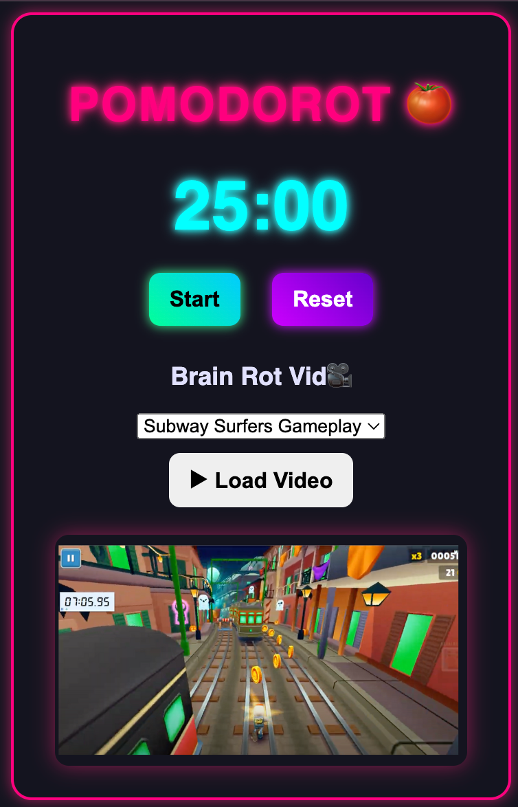

#  PomodoRot

### 📌 PomodoRot - A Gen Z Productivity Chrome Extension 🍅🌀

**🚧 Project Status** _This project is still in development and has not been published yet. Features may change as I continue working on it._

PomodoRot is a small side project I’m working on to practice HTML, CSS, and JavaScript. It’s designed to help with focus by combining the Pomodoro technique with background videos.

---

**Features:**
- pomodoro timer to break work into focused sessions
- embedded brain rot videos (Subway Surfers, Minecraft Parkour)
- cool neon cyberpunk UI

_This is useful for studying, coding, or when you need to sit through long lectures but want something engaging in the background._

  Created with 🫀 and 🧠 by Shaly &nbsp;&nbsp;&nbsp; ©2024  

